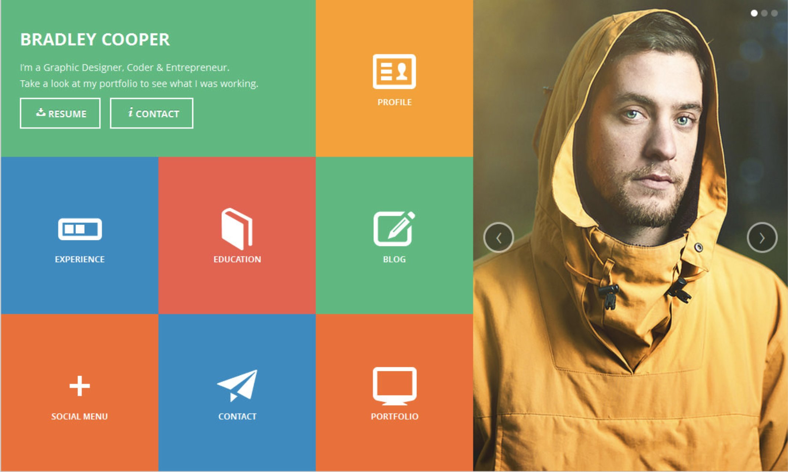
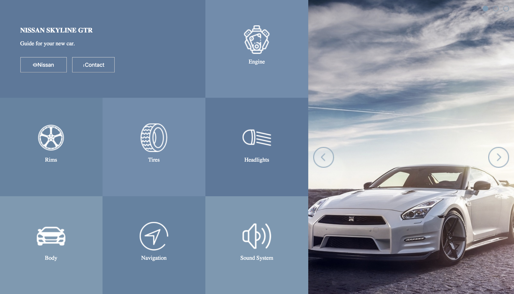

### AM-comp-challenge-1

I was given a design of a static comp to recreate and was given the liberty to choose my own theme. I chose to use the Nissan Skyline GTR and create a virtual manual for car owners. I was able to recreate the original design layout by using flexbox in CSS. My application is responsive and has media brake points in order to fit laptops, tablets, and smart phones.

Static Comp Challange

My Static Comp

